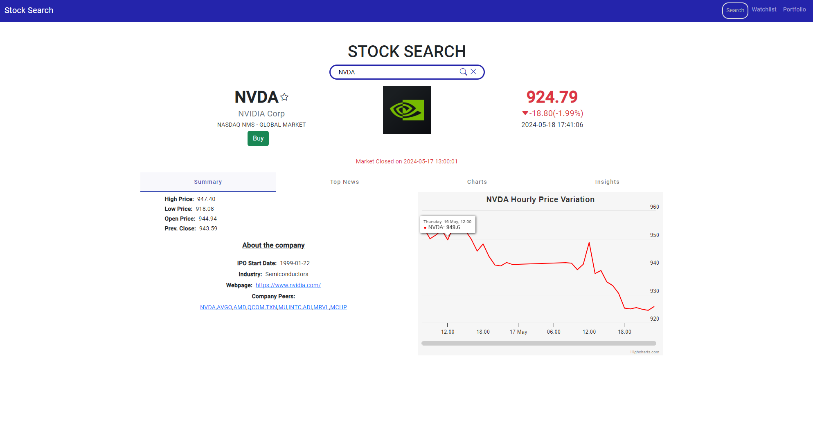
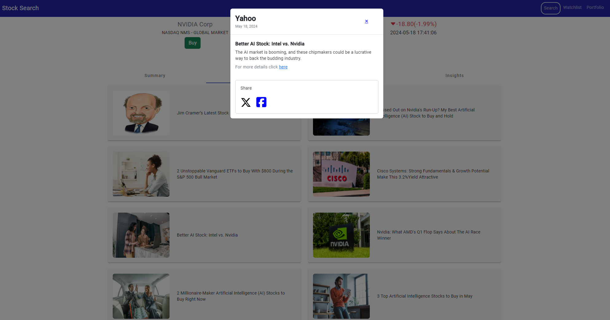
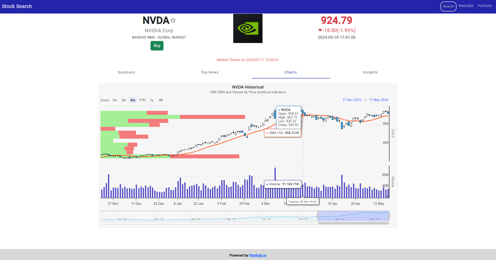
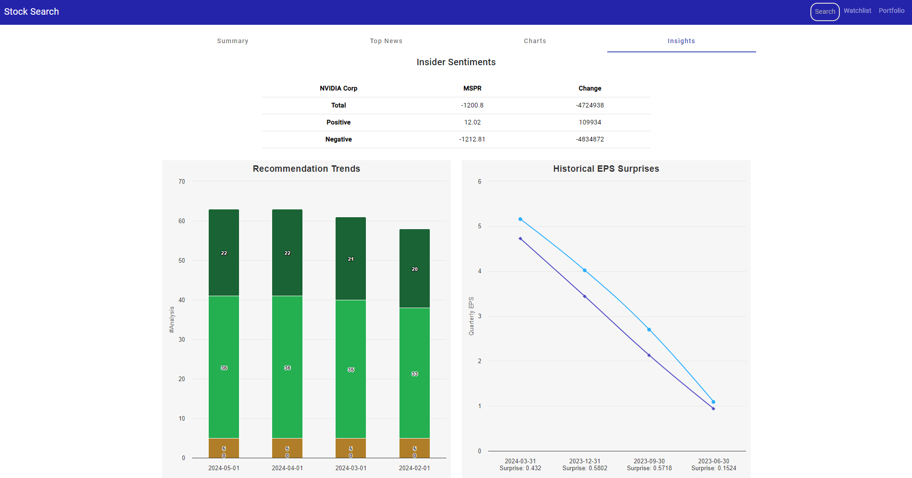
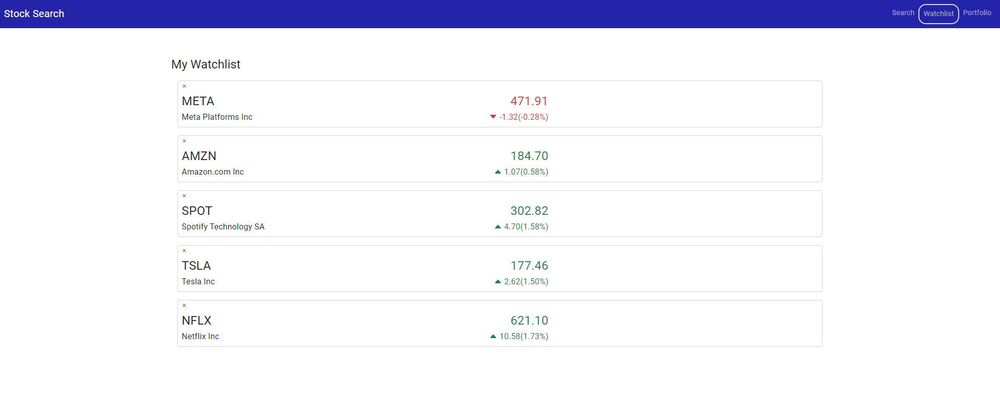
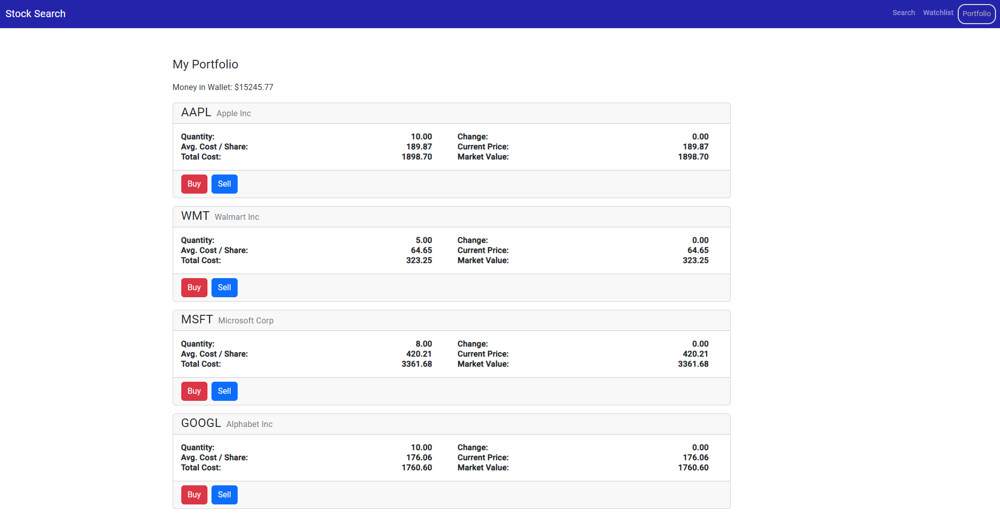

# Real-Time Stock Trading Simulator

This project was developed using [Angular CLI](https://github.com/angular/angular-cli) version 17.2.2.

This full-stack web application simulates live equity trading in a cloud environment. It features real-time stock transaction simulations, leveraging asynchronous data sharing for high fidelity. Built with Angular, TypeScript, and Bootstrap on the frontend and NodeJS on the backend with MongoDB as the primary database, the app is hosted on Google Cloud Platform.

## Features
- **Finnhub Stock APIs**: Fetch data for stock tickers, including price quotes, charts, and news.
- **Home Section**: Divided into Summary, Top News, Charts, and Insights tabs.
- **Stock Trading**: Buy and sell shares, with transaction results stored in MongoDB.
- **Portfolio Section**: Displays the user’s current portfolio.
- **Watchlist Feature**: Allows users to shortlist stocks to monitor.

## Tab Descriptions

### Summary
- Displays the company’s high, low, open, and previous close prices, along with company information like IPO date, industry, and peers.

### Top News
- Shows relevant news articles and updates about the company. Shows relevant news articles and updates about the company.
- Clicking on any news item card opens a modal with clickable links to share the news article as a post on Twitter or Facebook.

  
  

### Charts
- Provides historical stock price variations and technical indicators over different time periods.
- These charts are powered by Highcharts APIs and are interaction-enabled, allowing users to click on any point to see performance metrics such as the stock price at a particular time on a particular day.

### Insights
- Includes insider sentiments, recommendation trends, and historical earnings per share (EPS) surprises.

## Additional Functionalities
- **Watchlist**: Users can keep track of price variations for selected stocks.
- **Portfolio Management**: View and manage current stock holdings.

  
  

